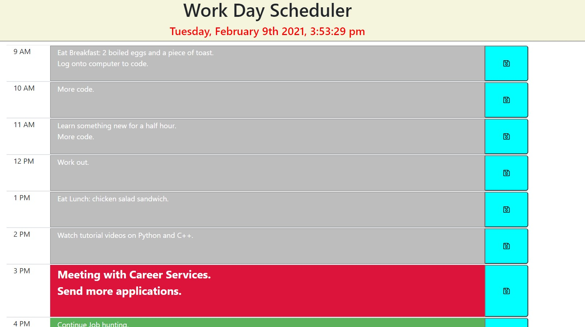

# Scheduler

## Description 

This is a basic scheduler that is reactive with the time. As time becomes the past it is greyed or completed. When it is the present it will be red as in urgent. The future is green so you can be aware of what has to be done. It is a great way to keep your days organized.

## Installation

This is a basic HTML application with Javascript backend simply open the link and have your clock running.

## Usage 

Use this to keep track of your day and stay on task.

## Credits

I would like to give a lot of credit to my TA Leigh Tracey she helped me understand the concepts needed for this assignment. Also my tutor Phil Loy gave me a lot of help with the Javascript side of the application.
